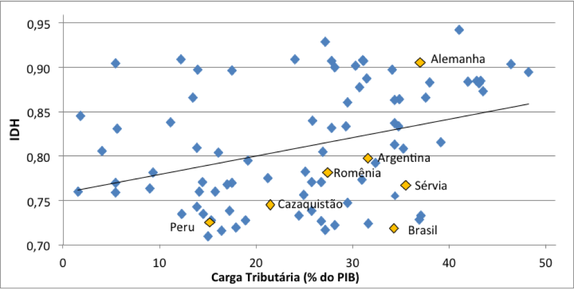

\addtolength{\headheight}{1.0cm}
\pagestyle{fancyplain} 
\lhead{\includegraphics[height=1.5cm]{logoIME.png}}
\rhead{\includegraphics[height=1.5cm]{images.jpg}}
\chead{UNIVERSIDADE FEDERAL DO RIO GRANDE DO SUL \\
INSTITUTO DE MATEMÁTICA E ESTATÍSTICA \\
DEPARTAMENTO DE ESTATÍSTICA \\
\vspace{0.3cm}
MAT02214 - Estatística Geral 1 - 2022/1
}
\renewcommand{\headrulewidth}{0pt} 


```{r setup, include=FALSE}
knitr::opts_chunk$set(echo = TRUE)
```


## Medidas de Associação

Agora, nosso interesse será analisar o relacionamento entre **duas variáveis numéricas** de interesse.

<!-- * **Exemplo 1**: O Índice de Desenvolvimento Humano (IDH) em países pode estar associado à carga tributária?   -->
<!-- { width=60% }   -->

<!-- Artigo de 2012: https://carodinheiro.blogfolha.uol.com.br/2012/12/14/pagamento-de-impostos-no-brasil-e-um-investimento-sem-retorno/ -->

<!-- \vspace{0.5cm} -->

* **Exemplo 1**: O valor do auxílio estudantil oferecido por uma universidade pode estar relacionado com a renda familiar dos estudantes?

```{r college_aid, message=FALSE, echo=FALSE, warning=FALSE, fig.width=3, fig.height=2, fig.align='center'}
library(ggplot2)
library(openintro)
data(COL)
data(elmhurst)
d <- elmhurst
g <- lm(d$gift_aid ~ d$family_income)
loss <- function(a, b, d) {
  p <- a + b * d$family_income
  sum(abs(d$gift_aid - p))
}
a      <- round(g$coef[1], 2) + seq(-0.5, 0.5, 0.001)
b      <- round(g$coef[2], 3) + seq(-0.01, 0.01, 0.0001)
mins   <- c(a[1], b[1])
theMin <- loss(a[1], b[1], d)
pb     <- txtProgressBar(1, length(a), style=3)
for (i in 1:length(a)) {
  for (j in 1:length(b)) {
    hold <- loss(a[i], b[j], d)
    if (hold < theMin) {
      mins <- c(a[i],b[j])
      theMin <- hold
    }
  }
}
# elmhurstScatterW2Lines
ggplot(data = d, mapping = aes(family_income, gift_aid)) + 
  theme(panel.border = element_rect(colour = "black", fill = NA, size = 1)) + 
  geom_point(color = 'skyblue3') + 
  labs(x = 'Renda Familiar ($1000s)', y = 'Auxílio da \nuniversidade ($1000s)') #+ 
  # geom_abline(slope = mins[2], intercept = mins[1], linetype = 'dashed', size = 1) + 
  # geom_smooth(formula = y ~ x, se = FALSE, method = 'lm', color = 'black')
```

## Associação entre Variáveis Quantitativas (Bussab e Morettin - seção 4.5)
Para duas variáveis quantitativas também podemos estar interessados em verificar se existe associação (relação) entre elas.  

### Gráfico de Dispersão

* **... cont. exemplo 1**: 

<!-- ```{r tabela1, echo=FALSE, warning=FALSE} -->
<!-- library(knitr) -->
<!-- tabela1 <- rbind(votos, abstencoes, habilitados) -->
<!-- tabela1 <- cbind(tabela1, rowSums(tabela1)) -->
<!-- rownames(tabela1) <- c("Votos", "Abstenções", "Total habilitados") -->
<!-- colnames(tabela1) <- c("Docentes", "Técnicos", "Estudantes", "Total") -->
<!-- kable(tabela1) -->
<!-- ``` -->

<!-- * **... cont. exemplo 2**:  -->

<!-- ```{r tabela2, echo=FALSE, warning=FALSE} -->
<!-- tabela2 <- rbind(chapa1, chapa2, chapa3, votos) -->
<!-- tabela2 <- cbind(tabela2, rowSums(tabela2)) -->
<!-- rownames(tabela2) <- c("Chapa 1", "Chapa 2", "Chapa 3", "Total votos válidos") -->
<!-- colnames(tabela2) <- colnames(tabela1) -->
<!-- kable(tabela2) -->
<!-- ``` -->

\vspace{0.3cm}
Como resumir a informação do gráfico acima em um só número?

<!-- \vspace{0.5cm} -->

### Coeficiente de correlação (linear) (de Pearson)

*Relembrando sobre covariância em probabilidade:*  
Definição (**covariância**): Sejam $X$ e $Y$ duas v.a. então $Cov(X,Y) = E \left\{ \left[ X - E(X) \right] \left[ Y - E(Y) \right] \right\}$. 

\vspace{0.2cm}

Definição (**covariância amostral**): Dados $n$ pares de valores observados $(x_1, y_1), \ldots, (x_n, y_n)$ (de duas v.a. $X$ e $Y$), chamaremos de covariância amostral antre X e Y a expressão
$$cov(X,Y) = \frac{ \sum_{i=1}^n (x_i - \overline x) (y_i - \overline y)}{n}$$. 

Assim, "padronizamos" a covariância para obtemos o coeficiente $corr(X,Y) = \frac{ cov(X,Y) }{s_x \cdot s_y}$, $-1 \leq corr(X,Y) \geq 1$.  

Definição (**coeficiente de correlação**): Dados $n$ pares de valores observados $(x_1, y_1), \ldots, (x_n, y_n)$ (de duas v.a. $X$ e $Y$), chamaremos de covariância amostral antre X e Y a expressão
$$corr(X,Y) = \frac{ 1 }{ n } \sum_{i=1}^n \frac{ (x_i - \overline x)}{s_x} \cdot \frac{ (y_i - \overline y)}{s_y}.$$  


<!-- * Duas variáveis aleatórias $X$ e $Y$ são ditas *independentes* se e somente se a probabilidade conjunta é igual ao produto das probabilidades marginais -->
<!-- $$P(X=i, Y=j) = P(X=i) \times P(Y=j),$$ -->
<!-- para todo $i=1, \ldots, k$ e $j=1, \ldots, l$. -->

<!-- * No teste de associação, a hipótese nula é dada por  -->
<!-- $$H_0: \pi_{ij} = \pi_{i.} \pi_{.j} \text{  ou  } H_0: P(X=i, Y=j) = P(X=i) \times P(Y=j).$$ -->


\vspace{0.2cm}

Em Estatística Geral 2 veremos como usar os valores de uma amostra observda para testar se existe correlação (associação)?


### Correlação espúria

### Causalidade e correlação

\vspace{0.5cm}

***
## Ler slides e ver vídeos da semana 4.
## Continuar lista de exercícios 1-2.
<!-- ## Fazer a avaliação pontual 1 da área 1 - VALE NOTA!!! -->
***

<!-- Trazer códigos em R para scatterplot e correlação, pegar exercícios da lista ou slides -->

<!-- **Exemplo 4**: Variável em estudo - gasto (em reais) em supermercado por pessoa (Slides 1-5, página 18). Qual o tipo de variável?   -->

<!-- No `R` as funções `summary()` e `boxplot()` retornam o resumo de cinco números e o gráfico de caixas. -->

<!-- ```{r exemplo2} -->
<!-- x <- c(9.26, 10.81, 3.11, 85.76, 70.32, 82.70, 18.43, 19.54, 23.04, 24.47, 26.24, 26.26, 24.58, 28.38, 28.06, 28.08, 25.13, 27.65, 32.03, 36.37, 19.27, 19.50, 18.36, 52.75, 61.22, 86.37, 93.34, 22.22, 20.16, 20.59, 54.80, 59.07, 50.39, 45.40, 44.08, 44.67, 38.64, 42.97, 46.69, 48.65, 39.16, 41.02, 38.98, 15.62, 13.78, 15.23, 8.88, 12.69, 17.00, 17.39) -->
<!-- summary(x) -->
<!-- boxplot(x) -->
<!-- ``` -->

<!-- Como incluir título e nomes nos eixos??? -->
